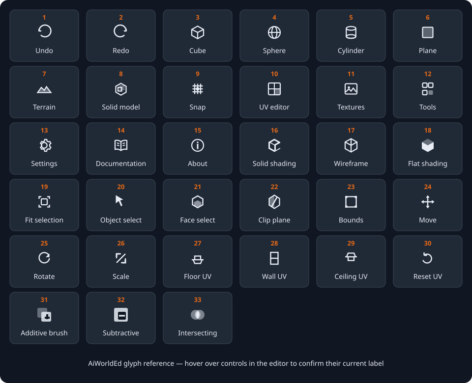

# Glyph Reference

AiWorldEd uses compact glyphs so the viewports have more room for the world you are building. This reference shows the current glyphs and explains what happens when you select each one.

The orange number above each visual example matches the tables below. In the editor, hover over a glyph to see its current name. An orange-highlighted button represents an active mode or enabled option; a dim button is unavailable in the current context.

## Main toolbar glyphs

| No. | Glyph           | What it does                                                                                                                                                                |
| --- | --------------- | --------------------------------------------------------------------------------------------------------------------------------------------------------------------------- |
| 1   | Undo            | Reverses the most recent undoable edit. The bottom status bar shows how many undo steps are available.                                                                      |
| 2   | Redo            | Reapplies the most recently undone edit. It is unavailable when there is no redo history.                                                                                   |
| 9   | Snap            | Turns grid snapping on or off. When highlighted, compatible transforms use the interval shown in the status bar; the nearby `−` and `+` text controls change that interval. |
| 10  | UV Editor       | Opens or closes the floating UV Editor. Select one or more face regions before using its surface-mapping controls.                                                          |
| 11  | Texture Browser | Opens or closes the floating Texture Browser, where you can choose a local texture folder and assign images.                                                                |
| 12  | Tools           | Opens or closes the Tools palette containing selection, transform, extrusion, and clip-plane controls.                                                                      |
| 13  | Settings        | Opens the Settings dialog for view, mouse, keyboard, game profile, and update preferences.                                                                                  |
| 14  | Documentation   | Opens the web-hosted user guide in a separate browser tab.                                                                                                                  |
| 15  | About           | Opens application information, version, license, and contributor details.                                                                                                   |

Cube, sphere, cylinder, plane, terrain, and solid-model creation now live in
the **Add Brush** dropdown instead of occupying separate toolbar glyphs. Open
the menu and select a brush type; the editor creates and selects it. The
**Solid Model** toolbar glyph opens the Solid Model panel rather than creating
one.

## Viewport header glyphs

Each viewport has its own shading and framing controls. A change made here applies to that viewport, allowing one view to remain solid while another displays wireframe geometry.

| No. | Glyph         | What it does                                                                                                        |
| --- | ------------- | ------------------------------------------------------------------------------------------------------------------- |
| 16  | Solid shading | Displays normally shaded surfaces. This is the clearest general-purpose view for judging form and materials.        |
| 17  | Wireframe     | Displays mesh edges without filled surfaces, making hidden structure and overlapping shapes easier to inspect.      |
| 18  | Flat shading  | Displays distinct polygon faces without smooth interpolation. Use it to inspect face boundaries and faceting.       |
| 19  | Fit selection | Frames the current selection in that viewport. It is the button equivalent of pressing `F` while working in a view. |

Wireframe Overlay is available through the `4` shortcut but does not have a dedicated header glyph. It shows shaded surfaces and their wire edges together.

## Tools palette glyphs

The first row chooses what kind of editing the pointer performs. The context area beneath it changes to match the selected tool.

| No. | Glyph         | What it does                                                                                                                                    |
| --- | ------------- | ----------------------------------------------------------------------------------------------------------------------------------------------- |
| 20  | Object Select | Makes clicks and drag-selection target complete objects. Use this before moving, rotating, scaling, grouping, duplicating, or deleting objects. |
| 21  | Face Select   | Makes selection target surface regions. Use it before per-face texturing, UV editing, or extrusion.                                             |
| 22  | Clip Plane    | Starts the three-point clipping workflow for selected geometry. Place three points, inspect the preview, then Flip, Clip, or Split.             |
| 23  | Bounds        | Shows a resizable bounding box around the object selection. Drag a face or handle to change dimensions; default shortcut `T`.                   |
| 24  | Move          | Shows translation handles for moving along axes or planes; default shortcut `W`.                                                                |
| 25  | Rotate        | Shows rotation handles for turning the selection around an axis; default shortcut `E`.                                                          |
| 26  | Scale         | Shows scale handles for proportional or per-axis resizing; default shortcut `R`.                                                                |

The Face Select context also contains text actions for **UV Editor** and **Extrude**, while Clip Plane uses text buttons for **Flip**, **Clip**, and **Split**. Their visible words are the glyphs' labels, so they are not repeated in the numbered visual plate.

## UV Editor glyphs

These controls establish a sensible surface orientation before you refine scale, offset, or rotation. They affect the currently selected face regions.

| No. | Glyph   | What it does                                                                                               |
| --- | ------- | ---------------------------------------------------------------------------------------------------------- |
| 27  | Floor   | Aligns mapping for an upward-facing horizontal surface. Use it for floors, platforms, and tops of objects. |
| 28  | Wall    | Aligns mapping for a vertical surface. Use it for walls and upright sides.                                 |
| 29  | Ceiling | Aligns mapping for a downward-facing horizontal surface. Use it for ceilings and undersides.               |
| 30  | Reset   | Restores the selected surfaces' default UV mapping while retaining their assigned texture.                 |

## Solid-brush operation glyphs

These glyphs appear in the Properties panel when an editable brush inside a solid model is selected. The highlighted glyph is the operation currently assigned to the selected brush; order still affects the final result.

| No. | Glyph        | What it does                                                                                                    |
| --- | ------------ | --------------------------------------------------------------------------------------------------------------- |
| 31  | Additive     | Adds the brush's volume to the solid-model result. Use it for walls, floors, platforms, and other matter.       |
| 32  | Subtractive  | Removes the brush's volume from the result. Use it to carve doors, windows, rooms, shafts, and other openings.  |
| 33  | Intersecting | Restricts the current result according to the brush's overlapping volume at that point in the evaluation order. |

## Hierarchy glyphs

The hierarchy uses colored characters and emoji rather than the outlined toolbar icon set. Their appearance can vary slightly with the operating system's font, but their meaning is consistent.

### Expand, visibility, and lock states

| Visual example | Meaning and action                                                                                  |
| -------------- | --------------------------------------------------------------------------------------------------- |
| `▶`            | The item has hidden children. Select the triangle to expand it.                                     |
| `▼`            | The item's children are visible. Select the triangle to collapse them.                              |
| `👁`            | The object is visible. Select the eye to hide it temporarily.                                       |
| `👁‍🗨`           | The object is hidden. Select it to restore visibility.                                              |
| `🔓`           | The object is unlocked and can be edited. Select it to protect the object.                          |
| `🔒`           | The object is locked against editing, deletion, and transformation. Select it to unlock the object. |

### Object-type glyphs

Object-type glyphs identify what an item represents; selecting one selects the corresponding hierarchy item rather than performing an immediate action.

| Visual example | Color in the editor | Meaning                                                            |
| -------------- | ------------------- | ------------------------------------------------------------------ |
| `📁`           | Orange              | Group containing child objects.                                    |
| `▣`            | Orange              | Solid-model root containing ordered brushes and a compiled result. |
| `▪`            | Green               | Editable solid brush volume.                                       |
| `▦`            | Amber               | Compiled visible result of a solid model.                          |
| `◼`            | Blue                | Cube or box mesh.                                                  |
| `●`            | Green               | Sphere mesh.                                                       |
| `▭`            | Purple              | Plane mesh.                                                        |
| `⬡`            | Teal                | Cylinder mesh.                                                     |
| `◇`            | Gray                | Mesh whose source shape has no more specific glyph.                |
| `☀`            | Orange              | Directional light.                                                 |
| `✦`            | Yellow              | Point light.                                                       |
| `◎`            | Red                 | Spot light.                                                        |
| `✧`            | Yellow              | Other light type.                                                  |
| `📷`           | Red                 | Camera object.                                                     |
| `○`            | Gray                | Other or unrecognized object type.                                 |

## Common non-icon controls

Some compact controls are typographic symbols rather than drawn glyphs:

| Visual example                    | What it does                                                                                     |
| --------------------------------- | ------------------------------------------------------------------------------------------------ |
| `▾` beside a menu name            | Opens the menu. If another menu is already open, moving across menu names switches between them. |
| **Add Brush** `▾`                 | Opens the brush-type menu for creating a cube, sphere, cylinder, plane, terrain, or solid model. |
| `−` beside Snap                   | Chooses the previous or smaller snap interval.                                                   |
| `+` beside Snap                   | Chooses the next or larger snap interval.                                                        |
| `×` in a floating-panel title bar | Closes that panel without deleting scene content or undoing edits already applied.               |
| `+ Box Brush`                     | Adds a new box brush to the active solid model.                                                  |

## If a glyph is unavailable

A dim or disabled glyph usually means that the editor needs a different selection or mode. Hover over it for its label, then check the status bar and confirm:

1. The appropriate object or face region is selected.
2. The required Object Select, Face Select, or Clip Plane tool is active.
3. The selected object is not locked.
4. A modal interaction is not waiting to be committed or canceled.

For a broader explanation of where these controls appear, see [Understanding the interface](understanding_the_interface.md).
